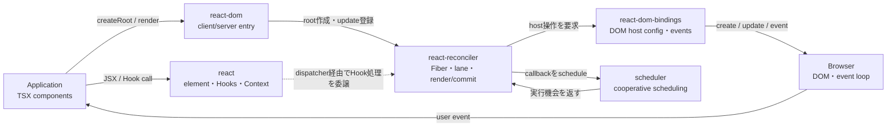
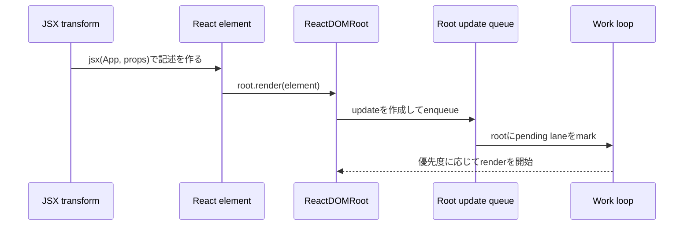
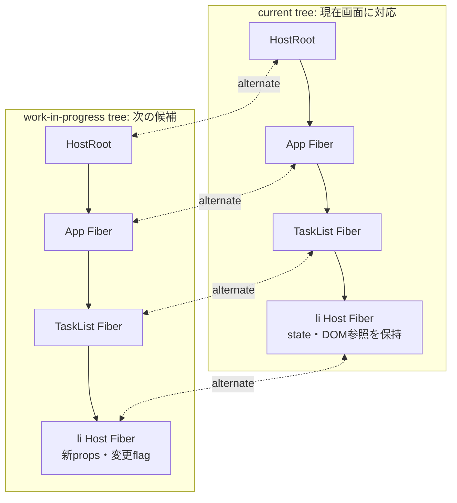
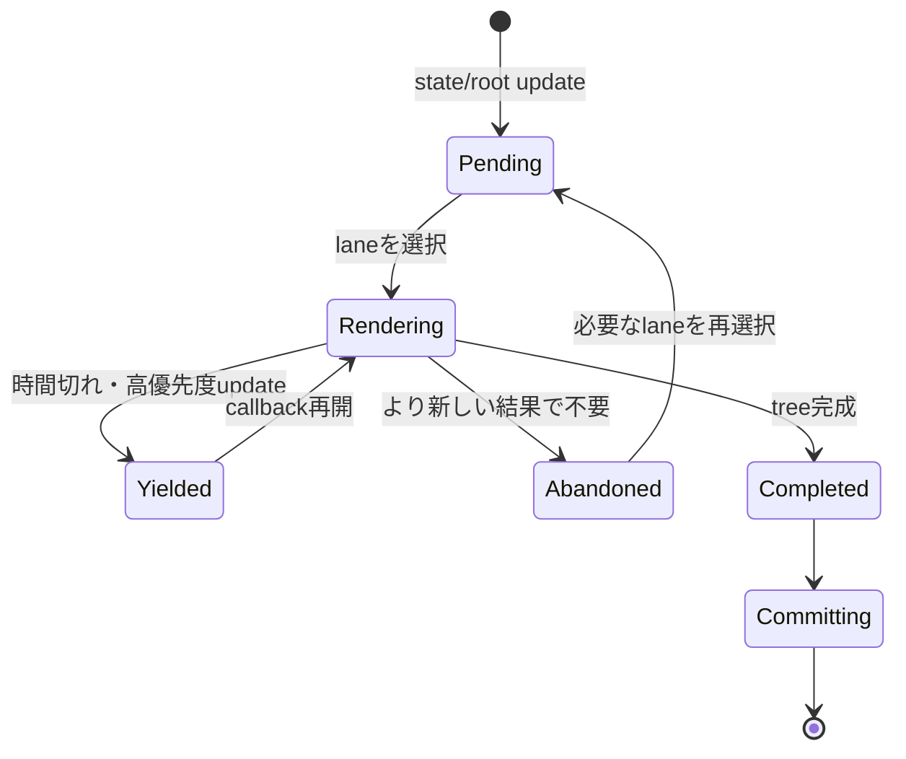
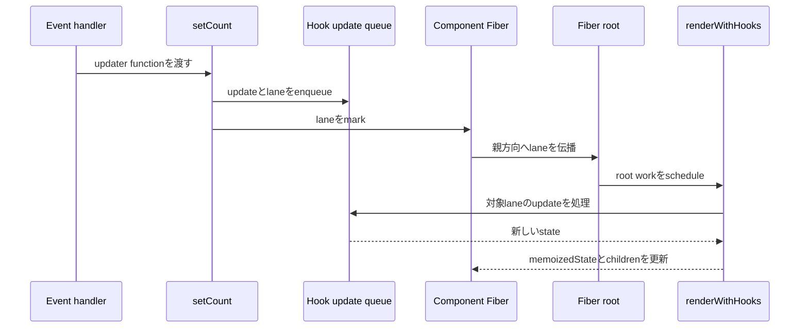
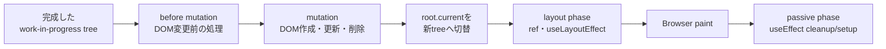
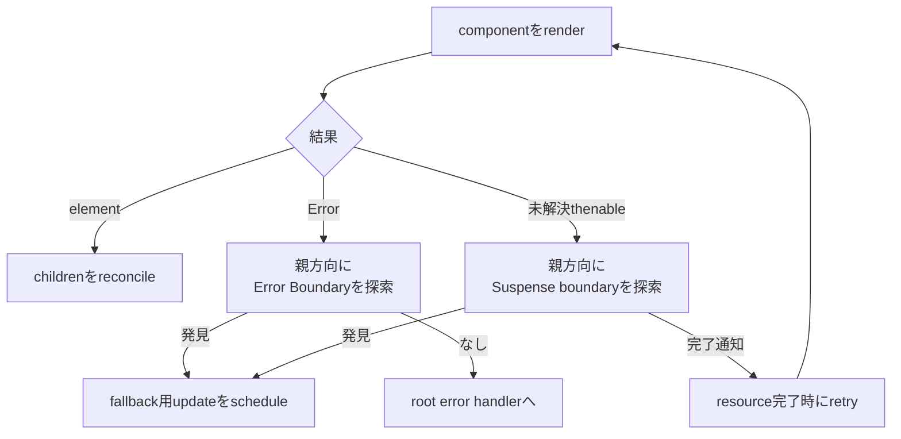

# React――状態からUIを導出するコンポーネントモデル

## 1. 概要

### Reactは何をするライブラリか

Reactは、Webやネイティブアプリケーションのユーザーインターフェースをコンポーネントとして記述するJavaScriptライブラリである。コンポーネントはprops、state、contextなどを入力として受け取り、「この時点で画面がどう見えるべきか」をReact elementの木として返す。React DOMのようなrenderer（レンダラー）が、その木を実際のDOMへ反映する。

次の例は、サーバーから取得したタスクを表示し、ボタン操作で完了状態を更新する最小のTypeScriptコンポーネントである。React 19.2系を前提とする。

```tsx
import { useEffect, useState } from "react";

type Task = {
  id: string;
  title: string;
  completed: boolean;
};

export function TaskCard({ taskId }: { taskId: string }) {
  const [task, setTask] = useState<Task | null>(null);
  const [error, setError] = useState<string | null>(null);

  useEffect(() => {
    const controller = new AbortController();

    async function loadTask() {
      try {
        const response = await fetch(`/api/tasks/${taskId}`, {
          signal: controller.signal,
        });
        if (!response.ok) {
          throw new Error(`HTTP ${response.status}`);
        }
        setTask((await response.json()) as Task);
      } catch (cause) {
        if (cause instanceof DOMException && cause.name === "AbortError") return;
        setError(cause instanceof Error ? cause.message : "取得に失敗した");
      }
    }

    void loadTask();
    return () => controller.abort();
  }, [taskId]);

  if (error !== null) return <p role="alert">{error}</p>;
  if (task === null) return <p>読み込み中...</p>;

  return (
    <article>
      <h2>{task.title}</h2>
      <button
        type="button"
        onClick={() =>
          setTask((current) =>
            current === null
              ? current
              : { ...current, completed: !current.completed },
          )
        }
      >
        {task.completed ? "未完了に戻す" : "完了にする"}
      </button>
    </article>
  );
}
```

JSXはHTML文字列ではなく、build時にJavaScriptへ変換される構文である。たとえば`<h2>{task.title}</h2>`は、表示内容を表すReact elementを生成する。Reactはこの記述から必要なDOM更新を決めるが、routing、data fetching、build、deploymentをすべて提供するわけではない。新規の本番アプリでは、React公式もroutingやdata fetchingを統合する[React対応frameworkから始める](https://react.dev/learn/creating-a-react-app)ことを勧めている。基礎学習や制約のあるSPAでは、Viteなどで[Reactアプリを一から構築](https://react.dev/learn/build-a-react-app-from-scratch)できる。Create React Appは2025年に[新規利用が非推奨となった](https://react.dev/blog/2025/02/14/sunsetting-create-react-app)。

Reactは、`document.querySelector`や`element.textContent`を使う命令的なDOM操作とも、`innerHTML`へ文字列を代入するtemplate処理とも異なる。開発者は更新手順ではなく、現在の状態に対応するUIを宣言する。Reactを一言で捉えるなら、**UIを「状態のsnapshotから導出されるコンポーネントの木」として扱い、実環境への反映をrendererへ委ねるライブラリ**である。

## 2. 歴史――複雑なUIを予測可能に更新するために

### 画面が変化するたび、手作業の同期が増えていった

2000年代後半から2010年代初頭にかけて、Webアプリケーションは文書を表示するものから、画面を開いたまま状態が変わり続けるものへ変化していた。FacebookのNews Feedを例にすると、新しい投稿、コメント、通知、チャット、既読状態が非同期に到着する。同じデータを件数表示、一覧、詳細画面など複数の場所が参照するため、一つのeventに応じて複数のDOMを正しい順序で更新しなければならなかった。

DOM APIやjQueryは個々の要素を変更するには十分だった。Backbone.jsのようなlibraryはmodelとviewの分離を助け、template engineはデータからHTMLを作りやすくした。しかし、loading、成功、失敗、選択状態、権限などの組み合わせが増えると、「データは更新したがbadgeだけ古い」「非同期応答の到着順で画面が巻き戻る」といった不整合が生じる。問題はDOM操作の書き方ではなく、**アプリケーションの状態と画面を人間が手続き的に同期し続けること**にあった。

### 2011〜2013年――更新手順ではなく、現在の見た目を宣言する

FacebookのJordan Walkeが作ったReactの前身は、2011年にNews Feed、2012年にInstagramで使われた。発想の転換は、変更箇所を開発者が列挙するのではなく、データが変わるたびにcomponentへ「今どう見えるべきか」を再び計算させることであった。

素朴に実DOMをすべて作り直せば、入力focusやscroll位置を壊し、処理量も大きくなる。そこでReactは、componentが返す軽量なelement treeを前回と比較し、必要なDOM変更だけを適用した。初期の公式記事[「Why did we build React?」](https://legacy.reactjs.org/blog/2013/06/05/why-react.html)が強調したのは、この「dataが変われば再renderする」というモデルである。一方向にpropsを渡すcomponent modelと組み合わせることで、ある瞬間のUIをその時点の入力から考えられるようにした。

Reactは2013年5月29日にopen sourceとして公開された。[Versionsページ](https://react.dev/versions)にはinitial public releaseのcommit `75897c`が記録されている。公開当初、JSXや「毎回renderする」という説明は、HTML・logicの分離や手動DOM最適化を重視していた当時の慣習とは異質だった。しかし、表示とevent処理を技術別fileではなく変更理由が同じcomponentへまとめる設計は、変化の激しいUIを局所的に保守する方法を示した。

### 2015年――ReactをDOMだけのlibraryにしない

component modelが広がると、同じ考え方をbrowser DOM以外でも使いたいという要求が現れた。2015年にはReact Nativeが公開され、componentが返す「何を表示するか」と、実際にDOMやnative viewを作る「どこへ表示するか」を切り離す意味が明確になった。

React 0.14ではDOM固有APIが`react-dom`へ分離された。`react`はelement、component、stateという共通modelを持ち、rendererがhost環境への反映を担当する構造になった。この分離は単なるpackage整理ではない。後にserver rendererやcustom rendererを発展させるための境界となり、現在の`react`、`react-dom`、`react-reconciler`という責務分担へつながった。

### 2016〜2017年――同期的な差分計算が、次の制約になった

初期のreconcilerは、一度更新を始めるとcomponent treeの処理を最後まで同期的に続けた。画面が小さければ問題になりにくいが、treeが大きくなるとmain threadを長く占有する。検索入力の直後に巨大な一覧を更新するような場面では、すべての更新を同じ緊急度で処理する限り、入力応答を優先できない。

また、render中のerrorから部分的に回復する仕組み、新しい種類の出力や非同期処理を追加する余地も限られていた。既存reconcilerへの継ぎ足しでは将来の要求に対応しにくくなり、React teamは内部architectureをFiberとして書き直した。

[React 16.0](https://legacy.reactjs.org/blog/2017/09/26/react-v16.0.html)で公開されたFiberは、component treeの処理を再開可能な小さなwork unitとして表現する。React 16の時点でconcurrent renderingが全面的に提供されたわけではないが、error boundary、fragment、新しいserver rendererを実現し、更新に優先度を付け、中断・再開・破棄するための土台を作った。つまりFiberは、当時の機能追加だけでなく、同期的な「一回始めたら終わるまで止められない」設計を将来に向けて解く投資であった。

### 2018〜2019年――componentは再利用できても、stateful logicは再利用しにくかった

Reactのclass componentでは、stateやlifecycle methodを使える一方、関連する処理が`componentDidMount`、`componentDidUpdate`、`componentWillUnmount`へ分散しやすかった。一つのlifecycle methodにsubscription、analytics、data fetchingなど無関係な処理が同居することもあった。

stateを伴うlogicをcomponent間で共有するには、higher-order componentやrender propsが使われた。これらは有効だが、wrapper componentが深く重なり、値がどこから来たか追いにくくなる場合がある。classではJavaScriptの`this`やmethod bindingも学習上の摩擦になっていた。

この問題への回答がHooksである。[React 16.8](https://legacy.reactjs.org/blog/2019/02/06/react-v16.8.0.html)でstableになったHooksは、state、Effect、contextなどをfunction componentから利用可能にし、関連するstateful logicをcustom Hookへまとめた。既存classを廃止する一括移行ではなく、function componentから段階的に採用できる形を選んだ。ただし、呼び出し順でstateを対応付けるため「top levelでのみ呼ぶ」という新しい制約も導入された。

### 2020〜2022年――表示内容だけでなく、更新の緊急度を扱う

Fiberが内部にあっても、公開APIがすべての更新を同期的に確定させるなら、中断可能なrenderの価値を十分に使えない。入力への追従は急ぐが、その入力に基づく検索結果一覧は少し遅れてもよい、といった更新間の違いをReactへ伝える必要があった。同時に、server renderingではHTMLをすべて生成してから送る方式が、遅いdata sourceによってページ全体を待たせていた。

2022年3月の[React 18](https://react.dev/blog/2022/03/29/react-v18)は、Fiberで積み上げてきた基盤をconcurrent renderer、transition、Suspense対応streaming SSRとして公開機能へ結び付けた。Reactは低優先度のrenderを中断し、より緊急な入力を処理し、古くなった準備中のUIを破棄できるようになった。automatic batchingは複数のstate updateをまとめ、不要なrenderを減らした。

重要なのは、全面的な「Concurrent Mode」への切替を要求しなかった点である。React teamは開発過程のfeedbackを受け、transitionなど対応機能を使った箇所から段階的にconcurrencyへ入る方針を選んだ。React 18のStrict Modeが開発時にEffectのsetupとcleanupを再実行するのも、将来UIを隠して再表示する場合に壊れる副作用を早期に発見するためであった。

### 2020〜2025年――非同期処理をUIの外付け規約にしない

component modelで表示を宣言できても、data mutationは依然として「pending stateを立てる、requestする、errorを保存する、成功時にstateを更新する」という定型処理を各applicationが組み立てていた。server renderingもHTML生成だけでは、clientへ送るJavaScript量とdata取得の境界を十分に最適化できなかった。

2020年に研究版が発表されたReact Server Componentsは、serverだけで実行するcomponentとinteractiveなclient componentを一つのtreeで構成する方向を示した。これはprotocolとbundler・frameworkの統合を必要とするため、React単体の低level APIだけで完結せず、frameworkとの協調が一層重要になった。

2024年12月の[React 19](https://react.dev/blog/2024/12/05/react-19)では、Actions、`use`、form Actions、`useOptimistic`などがstableになった。mutationに伴うpending、error、optimistic updateをReactのrenderとtransitionへ結び付け、applicationごとの定型的な状態同期を減らす更新である。`ref`を通常のpropとして渡せる変更やdocument metadata対応も、長く周辺APIやframeworkが埋めていた摩擦をcomponent modelへ取り込んだ。

### 2025年以降――捨てずに隠すUIと、運用時の観測へ

tabや戻る操作では、画面から消えたUIをunmountしてstateを捨てるより、非表示のまま保持して即座に戻したい場合がある。これはReact 18のStrict Modeが準備していた「Effectが何度でも停止・再開できること」と同じ方向の問題である。

[React 19.2](https://react.dev/blog/2025/10/01/react-19-2)の`<Activity>`は、非表示部分のstateを保持しながらEffectをcleanupし、表示中のworkを優先できる境界を提供した。同releaseの`useEffectEvent`は、Effect内で最新値を読みたい処理と、Effectを再同期させるdependencyを分ける。React Performance Tracksは、concurrent renderやcomponent performanceをbrowserのperformance panelで観測する手掛かりを加えた。2026年8月24日時点のlatest minorは19.2、GitHub Releases上の修正版は19.2.8である。

この歴史は、独立した機能の年表ではない。手動DOM同期を宣言的renderへ置き換え、そのrenderが大きくなるとFiberで作業を分割し、classに散らばったlogicをHooksで合成し、Fiberの余地をconcurrencyとして公開し、最後に非同期mutationやUIの休止まで同じmodelへ取り込んできた。各更新は以前の設計を捨てるのではなく、**「状態からUIを導出する」という最初の選択を、より大きく非同期なapplicationでも維持するための積み重ね**である。

## 3. 比較――どのUIライブラリを選ぶか

| ライブラリ | GitHub Stars | 設計の中心 | 強い場面 | 主なトレードオフ |
| --- | ---: | --- | --- | --- |
| [React](https://github.com/facebook/react) | 約245k | JavaScriptによるcomponentとrenderer非依存の宣言的UI | Webとnative、巨大なecosystem、frameworkを選択できる製品 | 本体だけではroutingやdata fetching方針が決まらず、render/effectのmental modelが必要 |
| [Vue](https://github.com/vuejs/core) | 約53.7k | Single-File Componentとreactivityを統合したprogressive framework | HTML/CSS/JSの関心をSFCに整理し、公式ecosystemでWebアプリを組む | template directiveとreactivityの規則を学ぶ必要があり、React componentとの互換性はない |
| [Svelte](https://github.com/sveltejs/svelte) | 約86.6k | compilerがcomponentを効率的な更新codeへ変換 | runtimeの抽象を減らし、簡潔なreactivityでWeb UIを作る | compile stepとSvelte固有構文へ寄り、React向けlibrary資産をそのまま使えない |
| [Preact](https://github.com/preactjs/preact) | 約38.8k | 小さなruntimeとReactに近いAPI | JavaScript転送量を厳しく抑えるclient UI、Reactからの段階移行 | `preact/compat`は高互換だが完全同一ではなく、React固有の新機能・integrationを確認する必要がある |

GitHub Starsは2026年8月24日時点で各公式repositoryに表示された概数であり、継続的に変動する。認知度や公開情報量を推測する参考にはなるが、品質、性能、保守状況、個別projectへの適合性を直接示す指標ではない。ReactとVue 2の旧repositoryのように世代でrepositoryが分かれる場合もあるため、単純な合計や大小だけで判断してはならない。

### Vueを選ぶ理由

Vueは`.vue` Single-File Componentの中でtemplate、logic、styleを明示的なblockとして扱う。

```vue
<script setup lang="ts">
import { ref } from "vue";

const count = ref(0);
</script>

<template>
  <button type="button" @click="count++">{{ count }}</button>
</template>
```

HTML templateを中心に考えたいチーム、Vue RouterやPiniaなど公式に近い選択肢で構成を揃えたいprojectではVueが有力である。reactive dependencyを追跡するため、component function全体の再実行を基本単位として意識するReactとは更新の捉え方も異なる。

一方、template directive、`ref`のunwrap、Composition APIのreactivity規則はVue固有である。React Nativeを含むrenderer横断や、Reactを前提とするcomponent資産が要件ならReactが適する。違いは「どちらが速いか」ではなく、UIをJavaScript functionとして一貫して表すか、templateとreactivityをframeworkが統合するかにある。

### Svelteを選ぶ理由

Svelte 5はrunesによりreactive stateとderived valueを表す。

```svelte
<script lang="ts">
  let count = $state(0);
  let doubled = $derived(count * 2);
</script>

<button onclick={() => count += 1}>
  {count} / {doubled}
</button>
```

compilerがcomponentをDOM更新codeへ変換するため、virtual treeとreconcilerをclient runtimeの中心に置かない。小さなinteractive siteや、SvelteKitを含む統合されたWeb開発体験を重視する場合に選ぶ理由がある。

代償は、`.svelte`構文とcompiler semanticsがarchitectureの中心になることである。ReactのHookやReact向けcomponent libraryを直接再利用することはできない。Reactの強みがrendererをまたぐ共通component modelとecosystemにあるのに対し、Svelteの重心はcompile時にWeb向けの更新を具体化する点にある。

### Preactを選ぶ理由

PreactはReactに近いcomponentとHook APIを、公式が「3kB alternative」と表現する小さなruntimeで提供する。

```tsx
import { render } from "preact";
import { useState } from "preact/hooks";

function Counter() {
  const [count, setCount] = useState(0);
  return <button onClick={() => setCount(count + 1)}>{count}</button>;
}

render(<Counter />, document.getElementById("app")!);
```

既存のReact風codeを保ちながら初期downloadを小さくしたい埋め込みwidgetや、client bundle budgetが厳しいsiteでは魅力がある。`preact/compat` aliasにより多くのReact ecosystem packageを利用できる。

ただし互換層を使うpackageごとに動作確認が必要であり、React Server Componentsや最新のReact固有APIまで同じとは限らない。bundle sizeだけでなく、利用するcomponent library、SSR framework、DevTools、native rendererまで含めて選ぶ必要がある。

## 4. 特徴――Reactらしさはどこにあるか

### 4.1 UIを純粋なrenderの結果として扱う

```tsx
type PriceProps = {
  amount: number;
  currency: "JPY" | "USD";
};

function Price({ amount, currency }: PriceProps) {
  return (
    <data value={amount}>
      {new Intl.NumberFormat("ja-JP", {
        style: "currency",
        currency,
      }).format(amount)}
    </data>
  );
}
```

同じprops、state、contextに対して同じJSXを返す純粋なcomponentなら、Reactはrenderを再試行、中断、破棄できる。これがconcurrent rendering、Strict Modeによる検査、server renderingの前提になる。利点は、表示結果を入力から局所的に推論しやすいことである。

代償として、render中にnetwork request、DOM mutation、外部変数の変更を行ってはならない。必要な副作用はevent handlerまたはEffectへ移す。ただし[「You Might Not Need an Effect」](https://react.dev/learn/you-might-not-need-an-effect)が説明する通り、表示用の派生値までEffectとstateで同期すると余分なrenderと不整合を生む。render中に計算できるものは、そのまま計算するのが基本である。

### 4.2 stateはsnapshotであり、更新はqueueに積まれる

```tsx
import { useState } from "react";

function Counter() {
  const [count, setCount] = useState(0);

  return (
    <button
      onClick={() => {
        setCount((value) => value + 1);
        setCount((value) => value + 1);
        setCount((value) => value + 1);
      }}
    >
      +3: {count}
    </button>
  );
}
```

event handlerが参照する`count`は、そのhandlerを作ったrender時点のsnapshotである。setterはその変数自体を書き換えず、次のrenderに向けてupdateをqueueへ積む。前のupdateに依存する場合は例のようなupdater functionを使う。[State as a Snapshot](https://react.dev/learn/state-as-a-snapshot)と[Queueing a Series of State Updates](https://react.dev/learn/queueing-a-series-of-state-updates)は、この挙動を公式のmental modelとして説明する。

この規則により一回のrenderは一貫する一方、命令的な代入に慣れた開発者にはstale closureが分かりにくい。state objectやarrayを直接mutationせず新しい値を作ること、非同期callbackがどのsnapshotを閉じ込めるかを意識する必要がある。

### 4.3 componentのidentityでstateの生存期間が決まる

```tsx
function Editor({ documentId }: { documentId: string }) {
  return <DocumentForm key={documentId} documentId={documentId} />;
}
```

stateはJSX tagの内側に保存されるのではなく、render tree上のcomponentの位置とtypeにReactが関連付ける。同じ位置・同じtypeなら保持され、typeまたは`key`が変われば新しいidentityとして初期化される。[Preserving and Resetting State](https://react.dev/learn/preserving-and-resetting-state)の考え方である。

これにより、tab切替で入力を保持するか、別documentへ移ったときformをresetするかを構造として表せる。反面、renderのたびにcomponent functionを内側で定義したり、不安定な`key`を付けたりすると意図せずstateを失う。`key`はlist warningを消すための連番ではなく、兄弟間のidentityである。

### 4.4 Hookでstateful logicを合成する

```tsx
import { useEffect, useState } from "react";

function useOnlineStatus() {
  const [online, setOnline] = useState(navigator.onLine);

  useEffect(() => {
    const enable = () => setOnline(true);
    const disable = () => setOnline(false);
    window.addEventListener("online", enable);
    window.addEventListener("offline", disable);
    return () => {
      window.removeEventListener("online", enable);
      window.removeEventListener("offline", disable);
    };
  }, []);

  return online;
}
```

custom Hookは、UI hierarchyを増やさず、subscriptionとstate更新のlogicをcomponent間で共有する。class inheritanceやrender propsに比べ、利用側は通常のfunction callとして組み合わせられる。

Hookはcall orderとFiber上のslotを対応させるため、[top levelでのみ呼ぶ](https://react.dev/reference/rules/rules-of-hooks)必要がある。この制約はlintで検査できるが、一般のfunctionにはないReact固有の規則である。またcustom Hookが共有するのはlogicであり、呼び出しごとのstateは独立している。

### 4.5 rendererを分離し、同じcomponent modelを複数環境へ適用する

`react` packageはelement、component、Hookなどの公開modelを持ち、`react-dom`はbrowser DOMとserver HTML、React Nativeはnative viewへ対応する。reconcilerとhost configの分離により、「何を表示するか」というcomponent codeと、「何へ反映するか」を分けている。

Webとnativeでdomain logicやcustom Hookを共有できることは利点だが、DOM elementを返すcomponentをそのままnativeで使えるわけではない。`<div>`と`<View>`、CSSとnative style、platform APIは異なる。共有境界をprops、state model、headless Hookへ置く設計が必要である。

## 5. 仕組み――elementから画面更新まで

Reactの内部を理解するときは、最初からすべてのfunctionを追うより、「表示要求を作る層」「次のtreeを計算する層」「実環境へ反映する層」を分けるとよい。公式の[Render and Commit](https://react.dev/learn/render-and-commit)が説明するtrigger、render、commitは、この責務分担を利用者側から見たものである。

### 主要コンポーネントと責務

| コンポーネント | 主な責務 | 主な入力 | 主な出力・保持するもの | 他コンポーネントとの関係 |
| --- | --- | --- | --- | --- |
| component | props、state、contextから次のUIを計算する | props、render時点のstate/context | React element | Hookを呼び、返したelementをreconcilerが読む |
| React element | 表示したいnodeのtype、props、keyを記述する | JSX | immutableな表示要求 | Fiberを直接変更せず、reconciliationの入力になる |
| Hook dispatcher | 公開Hook呼び出しを現在のmount/update処理へ振り分ける | `useState`などの呼び出し | Hook stateへの操作 | render中のFiberに対応するdispatcherをreconcilerが設定する |
| Fiber | componentごとのstateと作業単位を表す | element、前回のFiber、update | 親子兄弟link、state、queue、lane、flag | reconcilerがcurrent/work-in-progressの二つのtreeを管理する |
| update queue | 未処理のstate/root updateを保持する | setter、`root.render` | 優先度付きupdate列 | laneを通じてwork loopが処理時期を決める |
| lane | updateの優先度と同時処理可能な集合を表す | event priority、transition | bit maskで表した優先度 | scheduler選択とrender対象の絞り込みに使われる |
| scheduler / work loop | 実行すべきrootを選び、render workを進める | pending lane、利用可能な時間 | 完成・中断・失敗したwork | reconcilerのwork unitを処理し、完了時にcommitへ渡す |
| reconciler | elementと前回のFiberを対応付け、次のFiber treeを作る | element、current Fiber tree | work-in-progress tree、変更flag | host環境を直接操作せず、rendererのhost configを呼ぶ |
| host config / React DOM bindings | DOM固有の作成、property更新、event処理を提供する | host Fiber、props、DOM node | DOM操作 | reconcilerから呼ばれ、browser DOMへ変換する |
| commit処理 | 計算済みの変更を不可分に反映しEffectを実行する | 完成したFiber treeとflag | 新しいcurrent tree、更新済みDOM | mutation、layout Effect、passive Effectを段階的に処理する |

React elementとFiberは混同しやすい。elementはcomponentがそのrenderで返す短命な**表示要求**であり、FiberはReactがrenderをまたいでstate、update、作業状況を保持する内部nodeである。DOM nodeはさらに別物で、Web rendererがcommit時に作成・更新するhost objectである。

### package間の相互作用



`react`だけでは画面へ何も描かれない。`react-dom`がDOM用rootを作り、`react-reconciler`がrenderer非依存のtree計算を行い、`react-dom-bindings`がその結果をDOM操作へ翻訳する。`scheduler`は作業機会を調整するが、component stateやDOMの意味は持たない。この境界があるため、React Nativeはreconcilerを共有しながらDOMとは異なるhost実装を提供できる。

公開APIの入口は[`packages/react/index.js`](https://github.com/facebook/react/blob/main/packages/react/index.js)から[`packages/react/src/ReactClient.js`](https://github.com/facebook/react/blob/main/packages/react/src/ReactClient.js)へ、DOM clientの入口は[`packages/react-dom/client.js`](https://github.com/facebook/react/blob/main/packages/react-dom/client.js)から[`ReactDOMRoot.js`](https://github.com/facebook/react/blob/main/packages/react-dom/src/client/ReactDOMRoot.js)へ進むと確認できる。

### 1. JSXからupdateが登録されるまで

```tsx
import { createRoot } from "react-dom/client";

createRoot(document.getElementById("root")!).render(<App />);
```

JSX transformはproductionでは`react/jsx-runtime`の`jsx`または`jsxs`を呼び、type、props、keyなどを持つReact elementを作る。elementはDOM nodeを作らず、「rootのchildとして`App`を表示したい」という入力になる。

`createRoot`はDOM containerに対応するFiber rootを作る。`root.render(element)`は即座にcomponent tree全体をDOMへ変換する命令ではなく、rootのupdate queueへelementを登録し、処理すべきlaneをmarkしてworkをscheduleする。



element生成の実装は[`ReactJSXElement.js`](https://github.com/facebook/react/blob/main/packages/react/src/jsx/ReactJSXElement.js)、root updateへの入口は[`ReactDOMRoot.js`](https://github.com/facebook/react/blob/main/packages/react-dom/src/client/ReactDOMRoot.js)と[`ReactFiberReconciler.js`](https://github.com/facebook/react/blob/main/packages/react-reconciler/src/ReactFiberReconciler.js)にある。

### 2. reconciliationで次のFiber treeを作る

Fiberはcomponent tree上の各work unitである。type、key、親・子・兄弟へのlink、props、state、update queue、lane、変更flagを保持する。Reactは画面に対応する`current` treeと、次の候補である`workInProgress` treeを`alternate`で対応付ける。



`beginWork`は親から子へ進み、function componentを呼び出して得たchildrenを前回のchild Fiberと照合する。同じ位置でtypeとkeyが対応すればFiberとstateを再利用し、対応しなければ作成・削除のflagを付ける。`completeWork`は子から親へ戻り、host nodeの準備とsubtreeのflag集約を行う。

実装は[`ReactFiber.js`](https://github.com/facebook/react/blob/main/packages/react-reconciler/src/ReactFiber.js)、[`ReactChildFiber.js`](https://github.com/facebook/react/blob/main/packages/react-reconciler/src/ReactChildFiber.js)、[`ReactFiberBeginWork.js`](https://github.com/facebook/react/blob/main/packages/react-reconciler/src/ReactFiberBeginWork.js)、[`ReactFiberCompleteWork.js`](https://github.com/facebook/react/blob/main/packages/react-reconciler/src/ReactFiberCompleteWork.js)に分かれている。

「virtual DOMの差分」という説明だけでは、stateがなぜ保持・resetされるかを捉えにくい。Reactのreconciliationは、短命なelementを比較するだけでなく、**前回のFiberが表すcomponent identityとstateを次のworkへ引き継げるか判断する処理**である。

### 3. lane、scheduler、work loopが処理時期を決める

すべてのupdateが同じ緊急度ではない。text inputへの反映は急ぐが、検索結果の再描画はtransitionとして遅らせられる。Reactはlaneというbit maskでupdateの優先度と同時に処理する集合を表す。work loopはrootに残るlaneから次の対象を選び、必要ならschedulerへcallbackを登録する。



render phaseは中断・再開・破棄できる。このためcomponentはrender中にDOM変更やsubscriptionの開始をしてはならない。一方、commit phaseは完成した一つのtreeを画面へ反映する段階であり、途中の状態をuserへ見せないよう同期的に扱われる。

laneの定義は[`ReactFiberLane.js`](https://github.com/facebook/react/blob/main/packages/react-reconciler/src/ReactFiberLane.js)、root選択とwork loopは[`ReactFiberWorkLoop.js`](https://github.com/facebook/react/blob/main/packages/react-reconciler/src/ReactFiberWorkLoop.js)、cooperative schedulingは[`packages/scheduler`](https://github.com/facebook/react/tree/main/packages/scheduler)にある。

concurrent renderingは重い計算を消す仕組みではない。低優先度のworkを譲れるようにし、古くなった結果をcommitせず、緊急なeventへの応答機会を確保する仕組みである。効果を得るには、transitionなどで更新のurgencyを示し、renderを純粋に保つ必要がある。

### 4. `useState`がFiberとupdate queueを結ぶ

```tsx
const [count, setCount] = useState(0);
setCount((value) => value + 1);
```

公開`useState`はstateをmodule-level変数に保存するのではなく、その時点のdispatcherへ呼び出しを委譲する。reconcilerはfunction componentをrenderする直前に、初回用または更新用のdispatcherを設定する。mount時にはHook nodeを作ってFiberの`memoizedState`から始まるlinked listへつなぎ、更新時には同じ呼び出し順で対応するHook nodeを読む。



setterは対象Fiberとqueueを閉じ込めているため、event handlerから呼んでもどのcomponentを更新するか分かる。複数updateはqueueに保持され、選択中のlaneに従って次のstateへ畳み込まれる。低優先度のupdateを今回処理しない場合は、後のrenderで失わないようbase queueへ残す。

実装は[`ReactHooks.js`](https://github.com/facebook/react/blob/main/packages/react/src/ReactHooks.js)、[`ReactFiberHooks.js`](https://github.com/facebook/react/blob/main/packages/react-reconciler/src/ReactFiberHooks.js)、[`ReactFiberConcurrentUpdates.js`](https://github.com/facebook/react/blob/main/packages/react-reconciler/src/ReactFiberConcurrentUpdates.js)にある。Hookを条件分岐内で呼べないのは、render間でこのlinked listとcall orderの対応を保つためである。

### 5. commitがDOMとEffectを順序付ける

render phaseで完成したwork-in-progress treeは、変更flagを持つ。commit処理はそのflagだけを辿り、DOM mutation、同期的なlayout処理、非同期のpassive Effectを順序付ける。



DOM固有のnode作成やproperty更新はreconciler自身ではなく、`react-dom-bindings`のhost configが担当する。これによりreconcilerは「HostComponentを配置する」という判断を行い、rendererは「`button` DOM nodeを作り、`disabled` propertyを設定する」という操作へ翻訳する。

| commit段階 | 主な処理 | 開発者から見える例 | 中断可能か |
| --- | --- | --- | --- |
| before mutation | DOM変更前の情報取得、準備 | classの`getSnapshotBeforeUpdate` | しない |
| mutation | host nodeの挿入・更新・削除 | 画面のDOMが変わる | しない |
| current切替 | 完成treeを現在のtreeにする | 次のupdateが新stateを基準にする | しない |
| layout | refの接続、layout Effect | `useLayoutEffect`で寸法を読む | しない |
| browser paint | browserが描画する | userに更新が見える | React外部 |
| passive | passive Effectのcleanup/setup | `useEffect`でsubscriptionを同期する | 別taskとして処理され得る |

commitの中心は[`ReactFiberCommitWork.js`](https://github.com/facebook/react/blob/main/packages/react-reconciler/src/ReactFiberCommitWork.js)、DOM host configは[`ReactFiberConfigDOM.js`](https://github.com/facebook/react/blob/main/packages/react-dom-bindings/src/client/ReactFiberConfigDOM.js)、property処理は[`ReactDOMComponent.js`](https://github.com/facebook/react/blob/main/packages/react-dom-bindings/src/client/ReactDOMComponent.js)にある。

### errorとSuspenseはrender結果の別経路である

componentがrender中にerrorをthrowすると、Reactは親方向へ処理可能なError Boundaryを探し、そのfallbackを表示するupdateを作る。対応するboundaryがなければrootまで伝播する。Promiseに似たthenableを`use`などが読み、まだ値を利用できない場合は、Reactは最も近いSuspense boundaryへ処理を移し、そのrenderでfallbackを選ぶ。準備が整えばboundaryをretryする。



Error BoundaryとSuspenseは命令的に別画面へ切り替える仕組みではなく、通常のtree計算が完了できなかったときに、どのboundaryの代替UIを次のrender結果とするかを決める仕組みである。server renderingでは送信済みHTMLやstreaming boundaryも関係するため、client側の通常renderを理解した後に別経路として読むのがよい。

ここで示したGitHubリンクは現行のdefault branchを指しており、将来の変更で内容や配置が変わる可能性がある。特定versionの挙動を調べる場合は、利用中のrelease tag（たとえば`v19.2.8`）またはcommit SHAへ置き換える。Fiber、lane、dispatcher、個別fileはいずれも公開APIではなく、version間で変更され得る。

## 6. リポジトリ構成とソースコードの読み方

### React 19.2系の主要なディレクトリ

Reactは[公式repository](https://github.com/facebook/react)の`packages/`を中心とするmonorepoである。本体だけを読みたいときも、`react` packageだけではrender処理が完結しない点に注意する。

```text
react/
├── packages/
│   ├── react/                 # element、Hookなどrenderer非依存の公開API
│   ├── react-dom/             # DOM client/serverの公開entry
│   ├── react-dom-bindings/    # DOM node、property、eventのhost実装
│   ├── react-reconciler/      # Fiber、Hooks、lane、render/commitのcore
│   ├── scheduler/             # cooperative schedulingのprimitive
│   └── shared/                # feature flag、共通type、utility
├── compiler/                  # React Compiler本体と関連package
├── fixtures/                  # browserで挙動を試すfixture application
└── scripts/                   # build、release、testなどrepository tooling
```

依存の概略は、`react`がelementとcomponent向けAPIを公開し、`react-dom`が`react-reconciler`をDOM host configと組み合わせ、reconcilerが必要に応じて`scheduler`を使う、という関係である。sourceは主にFlowで型付けされているため、TypeScript利用者は構文差に戸惑うかもしれないが、unionやnullable typeの役割は対応付けられる。

### 推奨する読解順

#### 1. entry pointでpackage境界を確認する

最初に[`packages/react/index.js`](https://github.com/facebook/react/blob/main/packages/react/index.js)と[`packages/react/src/ReactClient.js`](https://github.com/facebook/react/blob/main/packages/react/src/ReactClient.js)を読む。ここではAPI実装を深追いせず、`Component`、`createElement`、Hooks、`Activity`などがどこからexportされるかを確認する。

次に[`packages/react-dom/client.js`](https://github.com/facebook/react/blob/main/packages/react-dom/client.js)からDOM client entryを確認する。server renderingは別の経路なので、client renderを理解するまでは`react-dom/server`、React Server Components、Compilerを後回しにしてよい。

#### 2. `createRoot(...).render(...)`を追う

次の短い呼び出しを題材にする。

```tsx
import { createRoot } from "react-dom/client";

createRoot(document.getElementById("root")!).render(<App />);
```

読む順序は次である。

1. [`react-dom/client.js`](https://github.com/facebook/react/blob/main/packages/react-dom/client.js)でpublic exportを見る。
2. [`ReactDOMRoot.js`](https://github.com/facebook/react/blob/main/packages/react-dom/src/client/ReactDOMRoot.js)で`createRoot`と`ReactDOMRoot.prototype.render`を見る。
3. [`ReactFiberReconciler.js`](https://github.com/facebook/react/blob/main/packages/react-reconciler/src/ReactFiberReconciler.js)でcontainer作成とupdate登録を見る。
4. [`ReactFiberWorkLoop.js`](https://github.com/facebook/react/blob/main/packages/react-reconciler/src/ReactFiberWorkLoop.js)でrootのscheduleとrender/commitへの入口を見る。
5. [`ReactFiberBeginWork.js`](https://github.com/facebook/react/blob/main/packages/react-reconciler/src/ReactFiberBeginWork.js)の`beginWork`でFiber tagごとの分岐を見る。

初回はすべてのfeature flagとerror pathを理解しようとせず、`HostRoot`、`FunctionComponent`、`HostComponent`の三種類に絞ると流れを失いにくい。

#### 3. `useState`のmountとupdateを追う

[`ReactHooks.js`](https://github.com/facebook/react/blob/main/packages/react/src/ReactHooks.js)の公開`useState`からdispatcherを経て、[`ReactFiberHooks.js`](https://github.com/facebook/react/blob/main/packages/react-reconciler/src/ReactFiberHooks.js)の`renderWithHooks`、mount/update用dispatcher、`mountState`、`updateState`、state setterのdispatchへ進む。

検索語を関数名に絞り、Hook linked list、update queue、laneの三点だけを図にするとよい。render-phase updateやoptimistic updateなどの例外経路は後回しにする。Rules of Hooksが単なるstyle ruleではなく、call orderでHook nodeを対応させる実装制約だと確認できれば最初の到達点として十分である。

#### 4. DOMへのcommitを追う

`<button disabled={true}>`のようなhost elementを一つ選び、[`ReactFiberCompleteWork.js`](https://github.com/facebook/react/blob/main/packages/react-reconciler/src/ReactFiberCompleteWork.js)から[`ReactFiberConfigDOM.js`](https://github.com/facebook/react/blob/main/packages/react-dom-bindings/src/client/ReactFiberConfigDOM.js)、[`ReactDOMComponent.js`](https://github.com/facebook/react/blob/main/packages/react-dom-bindings/src/client/ReactDOMComponent.js)へ進む。最後に[`ReactFiberCommitWork.js`](https://github.com/facebook/react/blob/main/packages/react-reconciler/src/ReactFiberCommitWork.js)でmutationとEffectの順序を見る。

event system、hydration、Suspense、server streamingはそれぞれ大きなsubsystemである。通常のclient mount/updateを一度追ってから、目的に応じて一つずつ広げる方がよい。

#### 5. testsとfixturesで仕様を確認する

各packageの`__tests__/`はsourceと近い場所にある。たとえばHookは[`packages/react-reconciler/src/__tests__/ReactHooks-test.internal.js`](https://github.com/facebook/react/blob/main/packages/react-reconciler/src/__tests__/ReactHooks-test.internal.js)、DOM propertyは`packages/react-dom/src/__tests__/`や`react-dom-bindings`配下を検索する。公開API名、warning文、issue番号を`rg`またはGitHub code searchで探すと、仕様とregressionの意図を把握しやすい。

`fixtures/`は手動確認用application、`packages/react-devtools-*`はDevTools、`compiler/`はCompilerであり、reconcilerの最初の読解では対象外にしてよい。benchmarkの数値を見る場合は、対象commit、browser、production build、測定scenarioが同じかを必ず確認し、別条件の結果を直接比較しない。

### 目的別に次に読むファイル

| 理解したいこと | ファイル |
| --- | --- |
| JSXが作るelement | [`ReactJSXElement.js`](https://github.com/facebook/react/blob/main/packages/react/src/jsx/ReactJSXElement.js) |
| Fiber nodeのfieldと二重buffer | [`ReactFiber.js`](https://github.com/facebook/react/blob/main/packages/react-reconciler/src/ReactFiber.js) |
| childと`key`のreconciliation | [`ReactChildFiber.js`](https://github.com/facebook/react/blob/main/packages/react-reconciler/src/ReactChildFiber.js) |
| Hook stateとupdate queue | [`ReactFiberHooks.js`](https://github.com/facebook/react/blob/main/packages/react-reconciler/src/ReactFiberHooks.js) |
| laneによる優先度 | [`ReactFiberLane.js`](https://github.com/facebook/react/blob/main/packages/react-reconciler/src/ReactFiberLane.js) |
| rootのrenderとschedule | [`ReactFiberWorkLoop.js`](https://github.com/facebook/react/blob/main/packages/react-reconciler/src/ReactFiberWorkLoop.js) |
| commitとEffectの順序 | [`ReactFiberCommitWork.js`](https://github.com/facebook/react/blob/main/packages/react-reconciler/src/ReactFiberCommitWork.js) |
| DOM propertyの反映 | [`ReactDOMComponent.js`](https://github.com/facebook/react/blob/main/packages/react-dom-bindings/src/client/ReactDOMComponent.js) |
| cooperative scheduler | [`Scheduler.js`](https://github.com/facebook/react/blob/main/packages/scheduler/src/forks/Scheduler.js) |


## 7. 公開されている実務事例

### Airbnb――複数versionを同居させて段階的にupgradeする

Airbnb Engineeringの[「How Airbnb smoothly upgrades React」](https://medium.com/airbnb-engineering/how-airbnb-smoothly-upgrades-react-b1d772a565fd)は、多数のWeb surfaceをReact 16から18へ移行した事例である。従来の単一versionを一度に更新する方法では、長期間のbranch、全componentの先行修正、release時の大きなriskが生じていた。

Airbnbはmodule aliasで旧版と新版を同一bundleに含め、environment単位で対象component treeが使うReact versionを切り替えるupgrade systemを構築した。TypeScriptの型差、DevTools、共有dependency、test環境もversion選択に合わせ、段階的なproduction rolloutとrollbackを可能にした。記事によれば、この仕組みで全Web surfaceをReact 18へ移し、canary版を使って次版のmigration workも早期に調査できるようにした。

実務上の要点は次の通りである。

- library本体だけでなく、type定義、renderer、test utility、共有packageを同じversion境界で扱う。
- 長期migrationでは「二つのversionをどう隔離するか」と「即時に戻せるか」が重要になる。
- 独自の複数version基盤は複雑であり、小規模projectがそのまま模倣するのではなく、feature flagと段階releaseという原則を持ち帰るべきである。

記事はReact 18移行時のものであり、個別APIはReact 19の現状と異なる。しかし、大規模dependency upgradeをatomic changeにしない設計は現在も有効である。

### SeatGeek――混在architectureとtest資産を先に可視化する

SeatGeekの[「Upgrading an Enterprise Scale React Application」](https://chairnerd.seatgeek.com/upgrading-an-enterprise-scale-react-application/)は、React 17から18への移行を、既存rootとNext.js appが同居するTypeScript codebaseで行った記録である。Enzymeを使う多数のtest、React 18未対応のdependency、二つのapp間のrender挙動が障壁になった。

チームは型checkとtestを移行の完了条件にし、dependency compatibilityを洗い出し、必要な箇所では一時的なadapterを用いた。移行中にはNext.jsのshallow navigationで予期しないapp全体のrerenderが起き、root間のpropsの渡し方まで追跡して原因を切り分けた。単に`createRoot`へ置換するだけでなく、application boundaryとtest strategyがupgrade可能性を決めた事例である。

実務上の要点は次の通りである。

- package graph、test renderer、SSR/frameworkとの組み合わせをversion更新前に棚卸しする。
- warningを消すだけでなく、navigation、hydration、effect回数などbehavioral testを置く。
- adapterはmigrationを前進させる一時的手段として期限と削除条件を決める。

EnzymeやReact 18固有の回避策は古くなり得る。現在のprojectではReact 19の[upgrade guide](https://react.dev/blog/2024/04/25/react-19-upgrade-guide)と利用frameworkのcompatibility情報を別途確認する必要がある。

### Sardine――import mapsとfeature flagで実trafficを検証する

Sardine Engineeringの[「The React 18 migration guide for high-stakes production environments」](https://www.sardine.ai/engineering/react-18-migration-guide-production-infrastructure)は、fraud detection dashboardの大規模TypeScript monorepoをReact 18へ移行した事例である。自動testを通過する微妙なbehavior changeが特定のproduction dataでのみ現れるため、一括releaseはrevertと原因特定が難しいという問題があった。

Sardineはimport mapでReact 17/18の配信先を切り替え、feature flagをuser・organization単位に適用した。社内利用者から対象を広げ、監視しながらrolloutした。またcodemodと独自ESLint ruleで、effect dependencyや無限renderなど繰り返し現れる問題を機械的に検出した。記事の価値は、React 18の性能を一般化することではなく、real trafficでしか見つからない互換性問題へrollback可能な実験基盤で対応した点にある。

実務上の要点は次の通りである。

- major upgradeをbinaryなdeployではなく、観測可能なexperimentとして設計する。
- version切替時にReactとReact DOMを必ず対で扱い、duplicate Reactを避ける。
- 発見した不具合を個別修正で終わらせず、codemodやlintへ戻して残りのcodebaseを検査する。

この事例もReact 18移行である。import mapによる二重配信はbundle・cache・singleton dependencyを複雑にするため、規模とriskが見合う場合の選択肢であり、一般的な初手ではない。

## まとめ

Reactの中心はJSXでもHookの個数でもなく、**UIを現在の状態から導出されるtreeとして宣言し、状態のidentityと実環境への反映をReactに管理させること**である。componentを純粋に保つ規則、stateのsnapshot、`key`、Effectのcleanupは別々の暗記事項ではない。renderを安全に再試行・中断し、整合したtreeだけをcommitするための一つの設計から生じている。

実務での選択は次のように整理できる。

- Reactは、Web/nativeをまたぐcomponent model、広いecosystem、複数のframework選択肢、段階導入を重視するときに選ぶ。
- Vueは、templateとreactivity、公式ecosystemをまとまったWeb開発体験として採用したいときに選ぶ。
- Svelteは、compiler中心のreactivityと小さなclient runtimeを受け入れ、Svelte固有の開発体験を選びたいときに向く。
- Preactは、Reactに近いAPIを維持しながらclient bundle budgetを優先し、利用packageの互換性を検証できるときに向く。

Reactを導入するとき最初に決めるべきなのは、stateをどのcomponentが所有するか、server dataとclient stateの境界、Effectが同期する外部system、component identityを表す`key`、そしてReact本体の外にあるrouting・data fetching・SSR・testをどのframeworkやlibraryへ任せるかである。この境界を明示すれば、Reactは画面部品の寄せ集めではなく、変化するUIを予測可能に保つための設計基盤になる。
