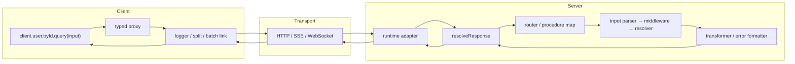
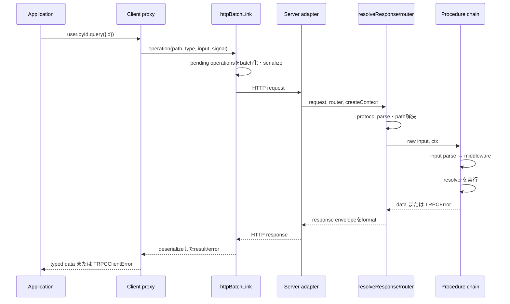
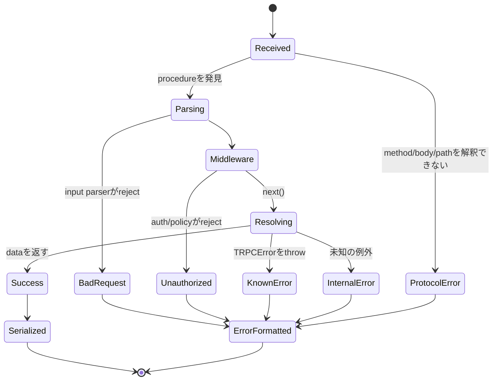

# tRPC――サーバーのTypeScript型をクライアントのAPIへつなぐ

## 1. 概要

### tRPCは何をするライブラリか

tRPCは、TypeScriptで書かれたサーバーのprocedure（手続き）から、その入力・出力・エラーの型をクライアントへ伝えるRPCライブラリである。サーバーではvalidator、認証などのmiddleware、business logicを組み合わせてrouterを作る。クライアントはそのrouterの**型だけ**を参照し、実際の呼び出しをHTTP、WebSocket、Server-Sent Events（SSE）などのtransportへ変換する。

次はtRPC v11系の最小例である。説明を一つのcode blockに収めるため同居させているが、実際にはserverとclientを別fileに置き、client側では必ず`import type`を使う。

```ts
// server.ts
import { initTRPC, TRPCError } from "@trpc/server";
import { createHTTPServer } from "@trpc/server/adapters/standalone";
import { z } from "zod";

const t = initTRPC.create();

const appRouter = t.router({
  user: t.router({
    byId: t.procedure
      .input(z.object({ id: z.string().uuid() }))
      .query(async ({ input }) => {
        const user = await findUser(input.id);
        if (user === null) {
          throw new TRPCError({ code: "NOT_FOUND", message: "User not found" });
        }
        return { id: user.id, name: user.name };
      }),
  }),
});

export type AppRouter = typeof appRouter;

createHTTPServer({ router: appRouter }).listen(3000);

// client.ts（実際には別file）
import { createTRPCClient, httpBatchLink } from "@trpc/client";
import type { AppRouter } from "./server";

const client = createTRPCClient<AppRouter>({
  links: [httpBatchLink({ url: "http://localhost:3000" })],
});

try {
  const user = await client.user.byId.query({
    id: "2c1d9c0f-26f7-4a93-b12e-27659f3f0832",
  });
  console.log(user.name); // userは{id: string; name: string}
} catch (cause) {
  console.error("ユーザー取得に失敗した", cause);
}

declare function findUser(
  id: string,
): Promise<{ id: string; name: string } | null>;
```

入力はZodによって実行時にも検査される。一方、resolverの戻り値からclientの出力型へ届く部分はTypeScriptの静的な型推論である。この区別は重要だ。`AppRouter`型を共有しても、通信相手が本当にその実装であること、古いclientと新しいserverが互換であること、戻り値がruntimeで宣言どおりであることまで自動検証されるわけではない。必要なら`.output()`へvalidatorを設定する。

`fetch`を手書きして`response.json() as User`と型アサーションする方法では、URL、method、input serialization、response typeを人が同期する。OpenAPIやProtocol Buffersは契約を別形式で定義してcode generationする。GraphQLはschemaとquery languageを境界にする。tRPCはこれらと異なり、**server implementationから得たTypeScript型を契約として、同じTypeScript圏のclientに直接投影する**。したがって、clientとserverを同じteamが管理し、変更をまとめて型検査できるBFF（Backend for Frontend）やmonorepoで特に適合する。

tRPCを一言で捉えるなら、**TypeScriptの型グラフをnetwork境界の両側へ連続させる、implementation-firstのRPC層**である。

## 2. 歴史――API契約の同期作業を型推論へ移すまで

### 同じTypeScriptなのに、HTTP境界で型が途切れていた

TypeScriptでfrontendとbackendの両方を書いても、素朴なHTTP APIでは型は自動的につながらない。serverのhandlerが返すobject、route、query parameterを変更しても、`fetch`のURL文字列やclient側のinterfaceは別物である。TypeScriptの型はcompile後に消えるため、HTTP越しに型情報が運ばれるわけでもない。

従来は、型を両側へ手書きする、共有packageへDTOを置く、OpenAPIやGraphQL schemaからclientを生成する、といった方法でこの断絶を埋めてきた。共有DTOだけではrouteや呼び出し方法との対応が保証されない。code generationは言語非依存の明示的な契約を得られる一方、schemaの更新、generatorの実行、生成物の配布という工程が加わる。小さなfull-stack TypeScript teamにとっては、外部公開に必要な安定契約より、この同期作業の方が重い場合があった。

作者Alex Johansson（KATT）は公式サイトで、traditional API layerを取り除き、素早く変更してもappを壊さない確信を持てるようtRPCを作ったと説明している。中心的な判断は、別のschema languageを発明するのではなく、router implementationの`typeof`をclientのgeneric parameterとして利用することであった。[公式トップページ](https://trpc.io/)の最小例にも、clientがserver codeではなく型宣言だけをimportする構造が示されている。

### 2020〜2021年――TypeScriptの推論をRPC clientへ投影する

tRPCは2020年に開発が始まり、初期versionではrouter上のquery・mutationと、その型から導かれるclientを中心に発展した。ここでの解決は、REST resourceの汎用的な記述でも、別言語で読めるIDLでもない。`appRouter`という実装をsingle source of truthにし、TypeScript proxyによって`client.user.byId.query()`のようなproperty accessをprocedure pathへ変換する方法であった。

この設計はcodegen待ちをなくしたが、初期clientがHTTP transportと密結合しているという制約を持った。2021年3月の[WebSocket transportに関するDiscussion](https://github.com/trpc/trpc/discussions/268)で、作者はclientからHTTPを分離し、Apollo Linkに似たlink chainを導入する構想を説明している。目的はWebSocket追加だけではなく、requestを観測・分岐・batch化し、queryとsubscriptionを異なるtransportへ流せる拡張点を作ることであった。この議論は、現在の`loggerLink`、`splitLink`、`httpBatchLink`、`wsLink`につながる。

### v9――router・procedure・middlewareという基本単位が固まる

利用が広がるにつれ、単に型付きfunctionを遠隔呼び出しするだけでなく、認証情報をrequestから作るcontext、procedure間で共有するauthorization、input validation、framework adapterが必要になった。v9世代までに、routerへprocedureを階層化し、middlewareが`ctx`を絞り込み、adapterがExpressやNext.jsなど固有のrequest/responseをcoreへ渡す現在の責務分担が形作られた。

この時点でtRPCは「Next.js専用data-fetching library」ではなくなった。server coreはprocedureを実行し、adapterがruntimeとprotocolへ接続し、client linkがtransportを選ぶ。React Query integrationはcacheやloading stateを担当する別層である。この分離によりvanilla client、server-to-server call、WebSocket subscriptionなどへ広げられたが、API surfaceとgeneric typeが複雑になり、次のmajor versionでは書き方自体の整理が必要になった。

### 2022年のv10――proxy APIとprocedure builderで「呼び出し」を揃える

v10では、文字列でprocedure名を登録・呼び出しする従来APIから、現在の`router({ user: ... })`、`procedure.input(...).use(...).query(...)`、`client.user.byId.query()`というproxy中心のAPIへ移った。2022年の[v10 client API design Discussion](https://github.com/trpc/trpc/discussions/2270)には、短さだけでなく、既存利用者が違和感なく読めるclient APIを探った過程が残る。

変更により、procedure pathはclientのproperty accessとして補完され、renameはclient側の型エラーとして現れる。builderはinput parserやmiddlewareを順に合成し、そのたびにinput・context・metaの型を更新する。この一貫性は利用体験を改善した一方、v9からのmigrationではrouter定義、client call、React Query hookを書き換える必要があった。また、深いrouter型をpackage境界へ持ち出すとTypeScriptの型計算やdeclaration emitが重くなる問題は残った。

### 2025年のv11――streaming、標準化、現行ecosystemへの適応

v11 stableは2025年3月に公開された。主な背景には、TanStack Query v5、React Server Components、Fetch/edge runtime、streaming response、非Zod validatorを含むecosystemの変化があった。v11では`createTRPCProxyClient`が`createTRPCClient`へ改名され、data transformerの指定はclient全体からterminating linkへ移動した。移行時にはserverと各linkで同じtransformerを設定しなければならない。

また、HTTP batchの結果を完了順に受け取れる`httpBatchStreamLink`、SSEを使うsubscription、`FormData`などnon-JSON input、Standard Schema対応が強化された。これらは「一つのJSON requestを送り、全結果が揃ってから返す」だけでは、遅いprocedureがbatch全体を待たせること、file uploadやstreamingを扱いにくいことへの回答である。2025年2月には[新しいTanStack React Query integration](https://github.com/trpc/trpc/discussions/6508)も発表され、tRPC独自hookでTanStack Queryを包む方向から、`queryOptions()`・`mutationOptions()`を生成してTanStack Query本来のAPIへ渡す方向へ進んだ。

v11はnetwork上の古いclientを自動的に守る仕組みではない。実際、v11.0.0〜v11.1.0のWebSocket serverには不正なconnection paramsでprocessが停止し得る脆弱性があり、v11.1.1で修正された。[公式security advisory](https://github.com/trpc/trpc/security/advisories/GHSA-pj3v-9cm8-gvj8)は、subscriptionを使う場合にも通常のdependency updateとsecurity monitoringが必要であることを示す。

2026年には長年の要求であった公式OpenAPI生成が`@trpc/openapi`のalphaとしてv11.16.0へ入り始めた。[公式Discussion](https://github.com/trpc/trpc/discussions/7239)によれば、query・mutation、OpenAPI 3.1.1生成、型からのoutput推論などを扱うが、調査時点ではalphaであり、subscriptionを含む完成済みのstable機能として扱うべきではない。

これらの節目を貫く設計思想は、network APIのすべてを独自規格へ置き換えることではない。**TypeScriptが見える範囲では推論を最大限に使い、runtime validation、transport、framework integrationは交換可能な境界として残す**ことである。そのため、同一TypeScript codebaseでは非常に短いfeedback loopを得る一方、言語・repository・release cycleが分かれるほど明示的な契約の価値が増す。

## 3. 比較――どのAPI設計を選ぶか

比較対象は、同じ課題に対して契約を置く場所が異なる3つに絞る。

| ライブラリ | GitHub Stars | 設計の中心 | 強い場面 | 主なトレードオフ |
| --- | ---: | --- | --- | --- |
| [tRPC](https://github.com/trpc/trpc) | 約40.5k | server実装のTypeScript型をclientへ推論 | 同じteamが管理するfull-stack TypeScript、BFF、monorepo | 他言語・独立release・public APIでは型共有が契約になりにくい |
| [GraphQL.js](https://github.com/graphql/graphql-js) | 約20.3k | schemaとclient指定のquery | 多様なclientが必要なfieldだけ取得するgraph API | schema・resolver・client tooling、N+1やquery costの運用が要る |
| [ts-rest](https://github.com/ts-rest/ts-rest) | 約3.3k | TypeScriptで明示するREST contract | HTTP method/status/header/OpenAPIを契約にしたいAPI | implementationから自動推論せず、contractと実装を対応させる必要がある |
| [Connect for ECMAScript](https://github.com/connectrpc/connect-es) | 約1.8k | Protocol Buffersによる言語非依存RPC | TypeScript以外のservice・mobile client、gRPC互換 | `.proto`とcode generationをbuild・review processへ組み込む |

GitHub Starsは2026年8月24日時点で各公式repositoryに表示された概数であり、継続的に変動する。認知度や情報量の参考にはなるが、品質、保守状況、security、個々のprojectへの適合性を直接示す指標ではない。

### GraphQL.jsを選ぶ理由

GraphQLではserverがschemaを公開し、clientがresponse shapeをqueryで指定する。

```ts
import {
  GraphQLNonNull,
  GraphQLObjectType,
  GraphQLSchema,
  GraphQLString,
  graphql,
} from "graphql";

const Query = new GraphQLObjectType({
  name: "Query",
  fields: {
    userName: {
      type: new GraphQLNonNull(GraphQLString),
      args: { id: { type: new GraphQLNonNull(GraphQLString) } },
      resolve: async (_source, { id }: { id: string }) => {
        const user = await findUser(id);
        if (user === null) throw new Error("User not found");
        return user.name;
      },
    },
  },
});

const result = await graphql({
  schema: new GraphQLSchema({ query: Query }),
  source: `query { userName(id: "user-1") }`,
});

if (result.errors) console.error(result.errors);

declare function findUser(
  id: string,
): Promise<{ id: string; name: string } | null>;
```

Web、iOS、Android、partnerが異なるdata requirementを持ち、一つのgraphから必要なfieldを選びたい場合はGraphQLが適する。schema introspection、tooling、言語非依存の契約も強い。対価として、schemaとresolverの設計、client type生成、authorization、query complexity、cache、N+1対策を運用する。画面ごとのprocedureをserverが決める方が自然で、両側がTypeScriptなら、GraphQLの柔軟性は過剰になることがある。

### ts-restを選ぶ理由

ts-restはTypeScriptでREST contractを先に定義し、serverとclientがそれを実装・消費する。

```ts
import { initContract } from "@ts-rest/core";
import { z } from "zod";

const c = initContract();

const contract = c.router({
  getUser: {
    method: "GET",
    path: "/users/:id",
    pathParams: z.object({ id: z.string().uuid() }),
    responses: {
      200: z.object({ id: z.string(), name: z.string() }),
      404: z.object({ message: z.string() }),
    },
  },
});
```

HTTP method、path、status code、headerを第一級の契約にし、既存REST infrastructure、gateway、cache、OpenAPI consumerと統合するならts-restが適する。tRPCにもHTTP mappingとOpenAPI alphaはあるが、日常APIはprocedure名とRPC envelopeを中心に考える。ts-restでは成功と失敗のstatusごとのbodyを明示できる一方、contractを先に保守し、handlerがそれを満たす形になる。

### Connect for ECMAScriptを選ぶ理由

ConnectはProtocol Buffersのservice定義からTypeScriptを生成し、Connect protocol、gRPC、gRPC-Webを扱う。

```proto
syntax = "proto3";
package example.user.v1;

service UserService {
  rpc GetUser(GetUserRequest) returns (GetUserResponse) {}
}

message GetUserRequest { string id = 1; }
message GetUserResponse { string id = 1; string name = 2; }
```

backendの一部がGo、clientがSwift/Kotlin、service間通信がgRPCという環境では、TypeScript型そのものを契約にするtRPCよりConnectが適する。field numberを含むschema evolution ruleとconformanceを利用できるためである。代わりに`.proto`、generator、生成物のversionを管理する。すべてを同じTypeScript workspaceで変更できるproduct teamでは、tRPCのcodegenなしのfeedback loopの方が短い。

## 4. 特徴――型推論が利用体験にどう表れるか

### 4.1 implementation-firstのエンドツーエンド型推論

```ts
const search = t.procedure
  .input(z.object({ query: z.string().min(1), limit: z.number().max(50) }))
  .query(async ({ input }) => {
    return searchUsers(input.query, input.limit);
  });
```

resolverが返す`Promise<User[]>`はrouter型へ入り、clientの`.query()`も`Promise<User[]>`になる。field renameやnullable変更は、serverを保存した時点でclientのcompile errorとして見える。別schemaと生成物を同期しないことが最大の利点である。

代償はcouplingである。型安全性が最もよく働くのは、clientがserver型の新しいsnapshotを参照してcompileされる時だ。既に配布されたmobile app、開きっぱなしのbrowser tab、別repositoryで更新されないclientはcompile対象外である。procedureの削除や必須input追加では、通常のAPIと同様に後方互換期間、versioning、telemetryが要る。

### 4.2 validatorを選べるruntime boundary

tRPCの`.input()`はZod専用ではなく、Standard Schema対応libraryなど複数のparser/validatorを受け取れる。inputは`unknown`から検査され、成功した値だけがresolverへ渡る。

```ts
const updateProfile = t.procedure
  .input(z.object({ displayName: z.string().trim().min(1).max(80) }))
  .output(z.object({ id: z.string(), displayName: z.string() }))
  .mutation(async ({ input }) => {
    return updateUser(input);
  });
```

input validationはnetwork boundaryの不正値を防ぐ。`.output()`を加えると、意図しないfieldや誤ったruntime valueをclientへ返す前にも検査できる。利点は静的型とruntime契約を必要な境界で重ねられること、代償はschemaの実行costと記述量である。戻り値推論だけではpasswordなど余分なfieldの漏洩を自動防止しないため、公開DTOを明示するかoutput validationを使う。

### 4.3 contextとmiddlewareによる横断的なpolicy

```ts
type Context = { session: { userId: string } | null };
const t = initTRPC.context<Context>().create();

const protectedProcedure = t.procedure.use(async ({ ctx, next }) => {
  if (ctx.session === null) {
    throw new TRPCError({ code: "UNAUTHORIZED" });
  }
  return next({ ctx: { session: ctx.session } });
});

const me = protectedProcedure.query(({ ctx }) => {
  return loadUser(ctx.session.userId);
});
```

middlewareの`next({ ctx })`はruntime valueだけでなく後続のcontext型も絞り込む。認証、tenant選択、logging、rate limitを再利用可能なbase procedureにできる。注意点は、middlewareがbusiness logicの置き場になりやすいこと、実行順が意味を持つこと、contextを巨大なservice locatorにするとtestと依存関係が不透明になることである。HTTP concernとapplication serviceを分離し、procedureは入力変換とuse case呼び出しに留めるとよい。

### 4.4 link chainでtransportと観測を分離する

```ts
const client = createTRPCClient<AppRouter>({
  links: [
    loggerLink({ enabled: (op) => op.direction === "down" }),
    splitLink({
      condition: (op) => op.type === "subscription",
      true: httpSubscriptionLink({ url: "/trpc" }),
      false: httpBatchLink({ url: "/trpc", maxItems: 10 }),
    }),
  ],
});
```

linkはoperationを受け、logging、routing、batching、serializationを合成する。clientのcall siteを変えず、query/mutationをHTTP batch、subscriptionをSSEへ流せる。batchはrequest数を減らすが、一つのrequestが大きくなり、authorization・rate limit・cacheの単位も変わる。server側の`maxBatchSize`とclient側の`maxItems`を揃え、proxyやCDNのURL/body上限を確認する必要がある。

### 4.5 TanStack Queryとは責務を分けて統合する

```ts
const options = trpc.user.byId.queryOptions({ id: "user-1" });
const query = useQuery(options);

if (query.isError) return <p role="alert">取得に失敗した</p>;
if (query.data === undefined) return <p>読み込み中...</p>;
return <p>{query.data.name}</p>;
```

tRPCはprocedureの型とtransportを提供するが、client cache、retry、stale time、invalidationはTanStack Queryの責務である。v11の新integrationはTanStack Query nativeなoptions objectを生成するため、`useQuery`以外にprefetchやserver-side hydrationでも同じ定義を再利用できる。反面、network errorのretryやmutation後のinvalidationはtRPCが自動決定しない。cache keyとdomain eventの対応をteamで設計する必要がある。

## 5. 仕組み――一つのprocedure callが往復するまで

### 主要コンポーネント

| コンポーネント | 責務 | 主な入力 | 出力・保持する状態 | 関係 |
| --- | --- | --- | --- | --- |
| `initTRPC` / root config | context、transformer、error formatterなどを確定する | generic型、設定 | `router`、`procedure`、`middleware` builder | 全server componentの型とruntime設定を共有する |
| procedure builder | input parser、middleware、resolverを順序付きで組み立てる | parser、middleware、query/mutation/subscription resolver | procedure definition | routerへ登録され、call時にchainを実行する |
| router | nested recordをdot-separated pathへ束ねる | procedure / child router | procedure map、router型 | adapterとcallerがpathからprocedureを解決する |
| adapter / `resolveResponse` | runtime固有requestを解析し、core callをresponseへ変換する | `Request`等、router、context factory | HTTP response、status、header | content-type handler、procedure、error formatterを仲介する |
| client proxy | property accessをoperationへ変換する | `AppRouter`型、method call | `{ path, type, input, context, signal }`相当のoperation | link chainへ渡す。server codeは保持しない |
| link chain | operationの観測・分岐・batch・transport | operation stream | result stream / transport error | HTTP、SSE、WebSocket linkへ終端する |
| transformer | networkで失われる値をserialize/deserializeする | input/output/error data | wire representation /復元値 | server configとterminating linkで一致させる |

ここで区別すべき値が三つある。利用者がclientへ渡す`{ id: string }`、linkが持つprocedure pathやtypeを含むoperation、HTTP上のURL・body・headerである。TypeScript型は一つ目のcompile-time制約であり、実際のnetworkには二つ目をencodeした三つ目しか流れない。

### 構造上の責務分担



proxyはserver functionを直接呼んでいるのではない。`user.byId`というproperty列をpathにし、`.query()`をoperation typeにする。terminating linkがそれをprotocolへencodeする。server adapterはframework固有requestを共通の`resolveResponse`へ渡し、そこからrouterのprocedureが選ばれる。

### `user.byId.query()`の通常sequence



段階ごとのstateは次のようになる。

| 段階 | 呼び出す側 → 呼び出される側 | 渡すdata | 保持・変更されるstate |
| --- | --- | --- | --- |
| 受付・登録 | application → proxy | input、abort signal等 | path segmentとoperation typeが確定する |
| transport準備 | proxy → link chain | operation | batch queueへ一時登録され、headerとURL/bodyが作られる |
| protocol解析 | adapter → `resolveResponse` | raw request | batchか、content type、各callのraw inputがmemoizeされる |
| core処理 | router → procedure chain | path、input、context | parserの結果とmiddlewareが更新したcontextを後続へ渡す |
| 反映 | resolver → response formatter → client | dataまたはerror | envelopeをserializeし、client側でdata/errorへ復元する |

同一process内のserver-side callでは`createCallerFactory`を使い、HTTPを通さず同じprocedure chainを呼べる。ただし、procedureから別procedureをcallerで呼ぶとcontext作成、middleware、validationを重複させやすい。共有business logicは通常のfunction/serviceへ抽出し、二つのprocedureから呼ぶ方が境界が明瞭である。

### 失敗と回復の経路



input parse failureは通常`BAD_REQUEST`、認証middlewareは`UNAUTHORIZED`/`FORBIDDEN`、存在しないpathは`NOT_FOUND`としてerror shapeへ変換される。未知の例外は`INTERNAL_SERVER_ERROR`に正規化される。`onError`はloggingやobservabilityに使えるが、clientへ返す情報は`errorFormatter`で制御する。database errorのmessageやstackをそのまま露出させてはならない。

retryは主にclient cache/transport層のpolicyであり、server procedureを自動的にtransactionへする機能ではない。mutationをretry可能にするならidempotency keyやunique constraintをapplication側で設計する。subscriptionではclient disconnect時のabort signalを見てresourceをcleanupし、async generatorの`finally`などでlistenerを解除する必要がある。

### 実装fileとの対応

- 初期設定とbuilder生成: [`initTRPC.ts`](https://github.com/trpc/trpc/blob/main/packages/server/src/unstable-core-do-not-import/initTRPC.ts)
- procedure builderとmiddleware chain: [`procedureBuilder.ts`](https://github.com/trpc/trpc/blob/main/packages/server/src/unstable-core-do-not-import/procedureBuilder.ts)
- routerとpath解決: [`router.ts`](https://github.com/trpc/trpc/blob/main/packages/server/src/unstable-core-do-not-import/router.ts)
- HTTP requestからresponseへのcore: [`resolveResponse.ts`](https://github.com/trpc/trpc/blob/main/packages/server/src/unstable-core-do-not-import/http/resolveResponse.ts)
- client operation実行: [`TRPCUntypedClient.ts`](https://github.com/trpc/trpc/blob/main/packages/client/src/internals/TRPCUntypedClient.ts)
- typed client proxy: [`createTRPCClient.ts`](https://github.com/trpc/trpc/blob/main/packages/client/src/createTRPCClient.ts)
- HTTP batch link: [`httpBatchLink.ts`](https://github.com/trpc/trpc/blob/main/packages/client/src/links/httpBatchLink.ts)

これらは現行default branchへのlinkであり、将来の変更で内容や配置が変わる可能性がある。特定versionを調べる場合はURLの`main`を利用中のrelease tag（例: `v11.18.0`）またはcommit SHAへ置き換える。特に`unstable-core-do-not-import`以下は名前どおり内部実装であり、applicationからimportする公開APIではない。

## 6. リポジトリ構成とソースコードの読み方

### v11系monorepoの主要なディレクトリ

公式repositoryはpnpm workspaceのmonorepoである。coreを理解する起点は[`packages/server`](https://github.com/trpc/trpc/tree/main/packages/server)と[`packages/client`](https://github.com/trpc/trpc/tree/main/packages/client)であり、UI integrationはその後に読む。

```text
trpc/
├── packages/
│   ├── server/src/                    # router、procedure、protocol、runtime adapter
│   │   ├── index.ts                   # @trpc/serverの公開entry point
│   │   ├── adapters/                  # Fetch、Express、Fastify、Next、WS等との接続
│   │   └── unstable-core-do-not-import/
│   │       ├── initTRPC.ts            # root configとbuilder factory
│   │       ├── procedureBuilder.ts    # parser・middleware・resolver合成
│   │       ├── router.ts              # procedure mapとcaller
│   │       └── http/                   # HTTP protocolのparse・response生成
│   ├── client/src/                    # typed proxy、link、transport client
│   │   ├── createTRPCClient.ts        # clientの公開factory
│   │   ├── internals/                 # operation dispatch等
│   │   └── links/                     # HTTP batch、logger、split、WS等
│   ├── tanstack-react-query/          # TanStack Query native integration
│   └── tests/                         # 型・protocol・integrationの横断test
├── examples/                          # Next.js、SSE、WebSocket等の実行例
└── www/docs/                          # versioned documentationのsource
```

依存の向きは、おおむねserver coreをadapterが包み、client coreをlinkがtransportへ接続し、TanStack integrationがtyped clientをcache APIへ適応する形である。`packages/tests`はpackageをまたいだ挙動を確認するため、sourceだけでは見えにくいwire formatや型errorの期待値を理解するのに有用である。

### 推奨する読解順

#### 1. 公開entry pointから境界を確認する

最初にserverの[`index.ts`](https://github.com/trpc/trpc/blob/main/packages/server/src/index.ts)とclientの[`index.ts`](https://github.com/trpc/trpc/blob/main/packages/client/src/index.ts)を見る。`initTRPC`、`TRPCError`、型推論helper、client/linkのどれが公開され、どの実装がinternalへ隠されているかを確認する。いきなり`unstable-core-do-not-import`を全て読むと、公開conceptと最適化detailを混同しやすい。

#### 2. `t.procedure.input(...).query(...)`を追う

[`initTRPC.ts`](https://github.com/trpc/trpc/blob/main/packages/server/src/unstable-core-do-not-import/initTRPC.ts)で`t.procedure`と`t.router`がどのfactoryから作られるかを見て、次に[`procedureBuilder.ts`](https://github.com/trpc/trpc/blob/main/packages/server/src/unstable-core-do-not-import/procedureBuilder.ts)で`.input()`、`.use()`、`.query()`を検索する。builderがdefinitionへparserとmiddlewareを蓄積し、最後にcall可能なprocedureを作る流れへ絞る。高度なexperimental optionは後回しでよい。

#### 3. client proxyからnetworkまで追う

[`createTRPCClient.ts`](https://github.com/trpc/trpc/blob/main/packages/client/src/createTRPCClient.ts)でtyped proxyが作られる箇所を確認し、[`TRPCUntypedClient.ts`](https://github.com/trpc/trpc/blob/main/packages/client/src/internals/TRPCUntypedClient.ts)の`query`、`mutation`、`subscription`へ進む。その後[`httpBatchLink.ts`](https://github.com/trpc/trpc/blob/main/packages/client/src/links/httpBatchLink.ts)を読み、operationがbatch loaderとHTTP transportへ渡るところまで追う。最初はWebSocket、SSE、streaming batchを同時に読まない。

#### 4. adapterから成功・失敗を追う

Fetch APIを知っているなら[`fetchRequestHandler.ts`](https://github.com/trpc/trpc/blob/main/packages/server/src/adapters/fetch/fetchRequestHandler.ts)が短い入口になる。adapterが[`resolveResponse.ts`](https://github.com/trpc/trpc/blob/main/packages/server/src/unstable-core-do-not-import/http/resolveResponse.ts)へ何を渡すかを確認し、`callProcedure`、input取得、context、error shape、response serializationの順に追う。`TRPCError`とHTTP statusの対応は[`getHTTPStatusCode.ts`](https://github.com/trpc/trpc/blob/main/packages/server/src/unstable-core-do-not-import/http/getHTTPStatusCode.ts)で確認できる。

#### 5. testsとexamplesで仕様へ戻る

[`packages/tests`](https://github.com/trpc/trpc/tree/main/packages/tests)では、`httpBatchLink`、`middleware`、`errorFormatter`、`createCaller`など、理解したい公開API名でrepository内検索する。型安全性はruntime testだけでは確認できないため、`expectTypeOf`や`@ts-expect-error`を含むtestも読む。実際のframework wiringは[`examples`](https://github.com/trpc/trpc/tree/main/examples)から一つだけ選び、coreの読解後に参照する。benchmarkは条件が変わりやすいため、異なるversionやadapterの数値を一般的な性能差として扱わない。

### `client.user.byId.query()`を追うfile順

```text
packages/client/src/createTRPCClient.ts
  → packages/client/src/internals/TRPCUntypedClient.ts
  → packages/client/src/links/httpBatchLink.ts
  → packages/server/src/adapters/fetch/fetchRequestHandler.ts
  → packages/server/src/unstable-core-do-not-import/http/resolveResponse.ts
  → packages/server/src/unstable-core-do-not-import/router.ts
  → packages/server/src/unstable-core-do-not-import/procedureBuilder.ts
```

最初の読解では、type-level utilityの全分岐、旧integration、全adapter、subscription protocolを対象外にしてよい。一つのqueryが成功する経路を通した後、input parse errorと`TRPCError`の二つを追加で追うと、公開APIと内部componentの対応が崩れにくい。

### 目的別に次に読むfile

| 理解したいこと | file |
| --- | --- |
| root configと`initTRPC` | [`initTRPC.ts`](https://github.com/trpc/trpc/blob/main/packages/server/src/unstable-core-do-not-import/initTRPC.ts) |
| input parser・middleware・resolverの順序 | [`procedureBuilder.ts`](https://github.com/trpc/trpc/blob/main/packages/server/src/unstable-core-do-not-import/procedureBuilder.ts) |
| nested routerとprocedure lookup | [`router.ts`](https://github.com/trpc/trpc/blob/main/packages/server/src/unstable-core-do-not-import/router.ts) |
| HTTP batch・context・response生成 | [`resolveResponse.ts`](https://github.com/trpc/trpc/blob/main/packages/server/src/unstable-core-do-not-import/http/resolveResponse.ts) |
| client linkへoperationを流す仕組み | [`TRPCUntypedClient.ts`](https://github.com/trpc/trpc/blob/main/packages/client/src/internals/TRPCUntypedClient.ts) |
| framework非依存のFetch adapter | [`fetchRequestHandler.ts`](https://github.com/trpc/trpc/blob/main/packages/server/src/adapters/fetch/fetchRequestHandler.ts) |
| HTTP error code mapping | [`getHTTPStatusCode.ts`](https://github.com/trpc/trpc/blob/main/packages/server/src/unstable-core-do-not-import/http/getHTTPStatusCode.ts) |

## 7. 公開されている実務事例

### Splarate――2人のfull-stack開発で契約同期を減らす

[「tRPCを導入したら爆速でWebサービスをリリースできた話」](https://zenn.dev/praha/articles/encouragement-trpc)は、2人で開発したSplarateにtRPCを導入した当事者の記事である。当初はGo backendとREST/OpenAPIを考えたが、schema作成と実装との乖離を小規模teamには重いと判断し、既存REST実装を止めてfull TypeScriptへ変更した。

記事では、server定義からclientまで型が届くこと、Zod validation、data transformer、SWRとvanilla clientの組み合わせが具体的に説明されている。API接続とvalidationの作業を減らし、product機能へ時間を使えたことが結果として述べられている。一方、記事中のcodeは2022年のv10初期APIであり、現在はprocedure登録やclient APIが異なる箇所がある。

実務上の要点は次の通りである。

- team全員が両側をTypeScriptで変更できるなら、schema合意よりcompile feedbackを優先する合理性がある。
- React専用hookを必須とせず、vanilla clientをSWR等と組み合わせられる。
- transformerなしのJSONでは`Date`や`undefined`のruntime表現が変わるため、型推論だけを信用しない。

この事例は、tRPCがOpenAPI一般を置き換える証拠ではなく、少人数・単一team・単一languageという条件で何を省けるかを読むとよい。

### Cal.com――巨大routerとserverless cold startの関係を測る

[「Cal.com Cold Start Resolution」](https://cal.com/blog/cal-com-cold-start-resolution-blog)は、Cal.com teamがserverless環境で7〜15秒、極端な場合30秒に達したcold startを調査した記事である。database connection、dependency、bundle sizeなど複数の仮説を検証した後、単一のtRPC endpointが20個のrouterと依存をimportする構造をbottleneckとして特定した。

最も単純なpublic routerを別のAPI routeへ分ける実験では15秒から2秒へ短縮した。最終的にrouterを複数のNext.js API routeへ分け、個々のcold startは2〜3秒残ったものの、browserから並行実行できるためpage全体は従来の直列的な7〜15秒より短くなったと記事は報告している。

実務上の要点は次の通りである。

- tRPCのprotocol overheadだけでなく、router import graphとserverless bundlingを測る。
- 一つのtyped routerへまとめる論理構造と、一つのfunctionへbundleするdeployment構造を同一視しない。
- 推測で分割せず、最小routerを独立させるexperimentでbottleneckを切り分ける。

数値は2023年当時のCal.com固有構成によるもので、現在のtRPCや任意のplatformに一般化できない。しかし、type-safeな一枚岩がdeployment unitまで一枚岩である必要はないという設計知識は現在も有効である。

### パブテク――feature flag判定をmiddlewareへ集約する

[「tRPC x Feature Flag で実現するスムーズなトランクベース開発」](https://zenn.dev/pubtech/articles/trpc-feature-flag-trunkbase)は、パブテクの新規productでfeature flagとtRPC middlewareを組み合わせた事例である。main branchへ小さくmergeしつつ、未公開機能を顧客から隠す運用において、各resolverへflag分岐を散らすと判定漏れが起こるという問題を扱う。

記事の設計は、flag情報をcontextへ置き、利用条件をmiddlewareとしてbase procedureへまとめる。各procedureはそのbase procedureから派生するため、handlerごとの手動checkよりpolicyを一貫させやすい。これはtRPC middlewareが単なるlogging hookではなく、型付きcontextとaccess policyの境界になる例である。

実務上の要点は次の通りである。

- feature flagの取得、判定、未許可時のerrorをprocedureごとに複製しない。
- `publicProcedure`、`protectedProcedure`、feature別procedureなど、policyが名前に現れるbase procedureを作る。
- flagを削除する時はmiddlewareだけでなく、routerのdead pathとclient cacheも整理する。

記事は特定のfeature flag service全体の性能や可用性を評価するものではない。policy集約のpatternと、外部flag障害時にfail-open/fail-closedのどちらを選ぶかを自分の要件に合わせて補う必要がある。

### Next.js + Expo――型が共有されてもreleaseは同期しない

[「tRPC v11でNext.jsとExpoの型を共有する。個人開発Web+iOSアプリの実構成」](https://zenn.dev/hirodeath/articles/trpc-share-types-next-expo)は、Turborepo内のNext.js 15 serverとExpo mobile appでtRPC v11の`AppRouter`型を共有し、同じ構成で2つのserviceを運用した事例である。router実体はWeb appへ残し、`packages/api`は型だけをre-exportするため、mobile bundleへserver codeを入れずに補完を得ている。

重要なのは、著者が限界も明記している点である。Webはdeployで一斉更新できるが、mobile binaryはstore審査とuser updateを経るため、古いclientが残る。型共有は開発時の不整合を検出しても、配布済みclientのprocedure削除やinput変更を防がない。そのため後方互換な変更、token失効時の共通処理、`RouterInputs`/`RouterOutputs`による型の再利用を運用へ組み込んでいる。

実務上の要点は次の通りである。

- client packageからはrouter valueでなく`AppRouter`をtype-only importする。
- mobileを含む場合、serverとclientが常に同時compile・deployされるという前提を置かない。
- auth token更新のようなtransport concernはlink/fetch wrapperへ集約し、画面ごとに実装しない。

この事例は、tRPCの適用範囲をWeb BFFからmobileへ広げられることと、その瞬間に通常のAPI versioning問題が戻ることを同時に示している。

## まとめ

tRPCの中心は、RESTを短く書くことでも、networkを消すことでもない。server routerのTypeScript型をclient proxyへ投影し、変更のfeedbackをHTTP実行後からcompile時へ前倒しすることである。input validation、middleware、link、adapterをこの型グラフの周囲に配置し、runtimeで必要な責務は明示的に残している。

実務での選択は次のように整理できる。

- 同じteamがclientとserverをTypeScriptで管理し、procedure単位のBFFを速く変更するならtRPCを選ぶ。
- 多様なclientがfieldを選択し、共有graphを探索するならGraphQLを選ぶ。
- HTTP method、status、header、OpenAPIを明示的なcontractにしたいならts-restを選ぶ。
- 他言語serviceやnative clientと長期的なwire contractを共有するならConnect/Protocol Buffersを選ぶ。

導入時に最初に決めるべきなのは、router fileの置き場所より**互換性の境界**である。誰が`AppRouter`型を参照できるか、serverとclientを同時releaseできるか、どのinput/outputをruntime validationするか、procedureをdeployment unitからどう分けるか、errorとauthorizationをどのbase procedureへ集約するかを先に決める。この境界がtRPCの適合範囲と一致していれば、API契約を同期する作業の多くをTypeScript compilerへ任せられる。
